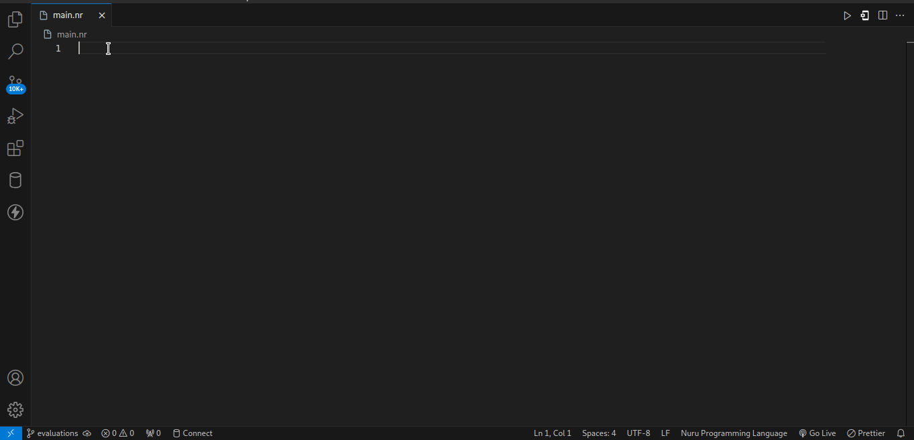

# Nuru-snippets

## Description

Nuru snipets provides some common snippets for the nuru swahili programming language

## Features

## Requirements

Nuru Programming Language Extension

## Release Notes

### 0.0.1

Initial release of ...

## Author
Edward Kaboi Ngugi

## For more information

* [Visual Studio Code's Markdown Support](http://code.visualstudio.com/docs/languages/markdown)
* [Markdown Syntax Reference](https://help.github.com/articles/markdown-basics/)

**Enjoy!**
